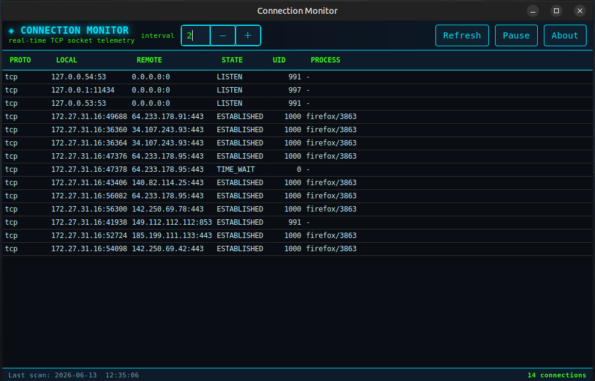

<div align="center">

<a href="https://github.com/effjy/connmon/"></a>

[](https://github.com/effjy/connmon/)
[](https://github.com/effjy/connmon/)
[](https://www.gtk.org/)
[](https://github.com/effjy/connmon/issues)
[](https://github.com/effjy/connmon/commits)

</div>

A real-time TCP connection monitor for Linux with a **GTK3** desktop UI and
a cyber-themed dark look.



`connmon` reads the kernel's connection tables straight from
`/proc/net/tcp` and `/proc/net/tcp6` — the same source `netstat` and `ss`
use — and refreshes a live table on an interval. For each connection it
resolves the **owning process** by scanning `/proc/<pid>/fd` for the
matching socket inode.

## Features

- Live GTK3 table of all IPv4 and IPv6 TCP connections, refreshed on a
  configurable interval (1–60 s).
- Decoded local/remote `address:port` and human-readable TCP state.
- **Process resolution** — maps each connection to its `command/pid`.
- Click any column header to sort.
- **Pause / Resume** and manual **Refresh** controls.
- Cyber dark theme (neon cyan / green on deep navy), monospace data grid.
- Global install with a custom app icon, desktop launcher, and taskbar icon.

## Requirements

- GTK 3 development files. On Debian/Ubuntu:

  ```sh
  sudo apt install build-essential libgtk-3-dev
  ```

## Build

```sh
make
```

This produces the `connmon` binary.

| Target           | Action                                            |
|------------------|---------------------------------------------------|
| `make`           | Compile `connmon`                                 |
| `make run`       | Compile and launch                                |
| `make clean`     | Remove the binary                                 |
| `make install`   | Install binary, icon, and desktop launcher        |
| `make uninstall` | Remove everything `install` added                 |

## Install

To install globally so **Connection Monitor** appears in your application
menu (with its icon) and can be launched from there or the taskbar:

```sh
sudo make install
```

This installs:

| File                                                       | Purpose            |
|------------------------------------------------------------|--------------------|
| `/usr/local/bin/connmon`                                   | Executable         |
| `/usr/local/share/icons/hicolor/scalable/apps/connmon.svg` | App / taskbar icon |
| `/usr/local/share/applications/connmon.desktop`            | Menu launcher      |

The icon cache and desktop database are refreshed automatically. To remove
it all again:

```sh
sudo make uninstall
```

`PREFIX` defaults to `/usr/local`; override it if you like:
`sudo make install PREFIX=/usr`.

## Usage

Launch **Connection Monitor** from the application menu, or run `connmon`
from a terminal. Use the **interval** spinner to change the refresh rate,
**Pause/Resume** to freeze the view, and **Refresh** for an immediate scan.

## Columns

| Column    | Description                                             |
|-----------|---------------------------------------------------------|
| `PROTO`   | `tcp` (IPv4) or `tcp6` (IPv6)                            |
| `LOCAL`   | Local `address:port`                                    |
| `REMOTE`  | Remote `address:port` (`0.0.0.0:0` for listeners)       |
| `STATE`   | TCP state (`ESTABLISHED`, `LISTEN`, `TIME_WAIT`, …)     |
| `UID`     | User ID owning the socket                               |
| `PROCESS` | `command/pid` of the owning process, or `-` if unknown  |

## Permissions

Process resolution works by reading `/proc/<pid>/fd`, which is only
readable for **your own** processes as a normal user. Sockets owned by
other users show `-` in the `PROCESS` column. To resolve every connection
on the system, launch as root, e.g.:

```sh
sudo connmon
```

When running as root, the status bar shows a `• root` indicator.

## How it works

1. Each refresh, the `/proc/net/tcp` and `/proc/net/tcp6` tables are
   parsed. Addresses there are little-endian hex words, decoded with
   `inet_ntoa` / `inet_ntop`.
2. `/proc` is walked once per refresh; for every process, each entry in
   `/proc/<pid>/fd` is `readlink`'d and matched against the
   `socket:[<inode>]` form to build an inode → process map.
3. Each connection's socket inode is looked up in that map to fill the
   `PROCESS` column.

## Limitations

- Linux only — it depends on the `/proc` filesystem layout.
- TCP only (UDP and UNIX sockets are not shown).
- The `/proc` scan is a simple linear lookup; fine for typical hosts,
  not optimized for tens of thousands of connections.

## About

**Connection Monitor** — by Jean-Francois Lachance-Caumartin.
Repository: <https://github.com/effjy/connmon/>

## License

Public domain / do whatever you like.
